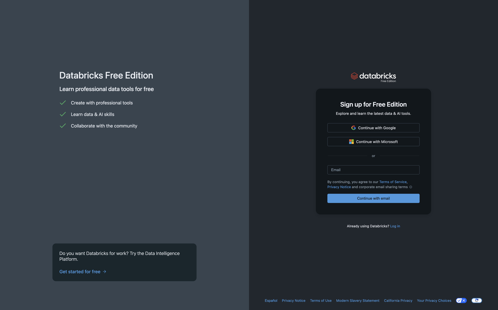
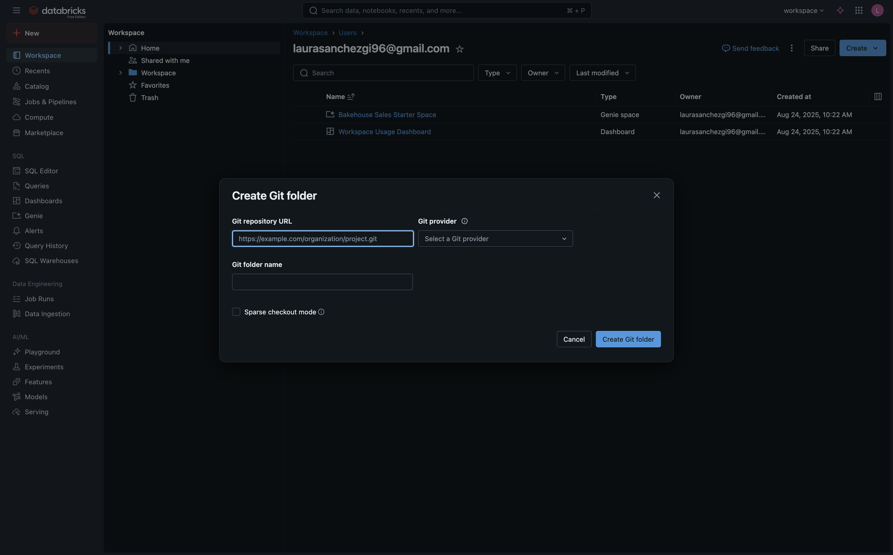
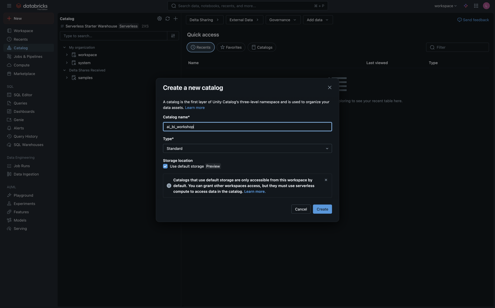
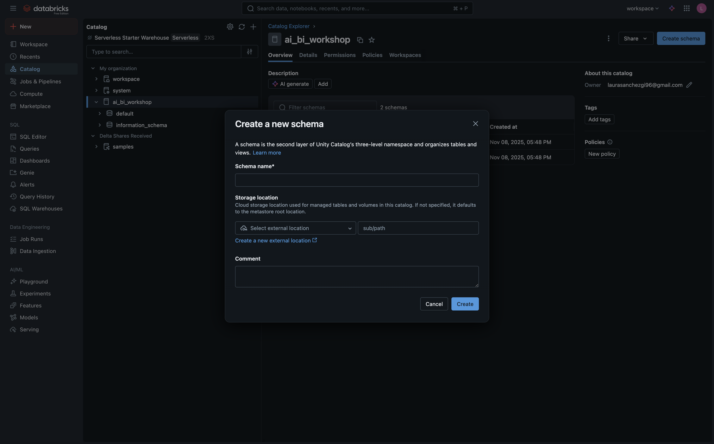

# 🚀 AI/BI en acción con Databricks: Potencia tus datos con Genie y AI Gen

Este repositorio acompaña el workshop **AI/BI en acción con Databricks**, un espacio práctico para descubrir cómo **Databricks AI/BI**, impulsado por **Genie** y **AI Gen**, transforma la forma en que interactuamos con los datos.

A lo largo del taller, aprenderás a:

- Usar **Genie** para realizar análisis conversacionales sobre datos gobernados en Unity Catalog.
- Aprovechar **AI Gen** para generar descripciones semánticas, metadatos y tableros inteligentes de manera automática.
- Construir tableros interactivos que combinan IA, automatización y gobernanza en el Lakehouse.

---

## 🧠 Agenda del Workshop

1. Bienvenida y visión AI/BI
2. De BI tradicional a AI/BI en Databricks
3. **Genie**: análisis conversacional sobre tus datos
4. **AI Gen**: generación automática de descripciones y dashboards
5. Construcción de un tablero AI/BI paso a paso
6. Cierre y recursos adicionales

---

## ✅ Prerrequisitos

Antes de comenzar, asegúrate de tener:

- Una cuenta activa en **Databricks Free Edition**
- Navegador web moderno (Chrome o Edge recomendado)
- Conocimientos básicos de SQL o Python

No necesitas instalar nada localmente. Todo se hará desde el entorno web de Databricks.

---

## 🪄 Parte 1 – Crear tu cuenta en Databricks Free Edition

1. Ingresa a 👉 [Databricks Free Edition](https://www.databricks.com/learn/free-edition)
2. Selecciona **Sing up for Free Edition**
3. Regístrate con tu correo personal



---

## 🧰 Parte 2 – Clonar este repositorio en Databricks

1. Dentro de tu workspace, abre el menú lateral y selecciona:
   **Workspace → Repos → Add Repo**
2. En el campo de URL, ingresa:

   ```bash
   https://github.com/dbcrewlatamstudygroup/workshop-genie
   ```

3. Cambia el nombre local del repositorio a algo como:

   ```bash
   ai-bi-databricks
   ```

4. Haz clic en **Create**.



Una vez clonado, verás los archivos en tu entorno de trabajo. Solo usaremos la carpeta y notebooks relacionados con **Databricks (Genie y AI Gen)**.

---

## 🧱 Parte 3 – Configuración del entorno en Databricks

### 1. Crear un catálogo

- Navega a **Catalog → Add data → Create a catalog**
  - Nombre: `ai_bi_workshop`
  - Tipo: `Standard`
  - Ubicación: predeterminada
  - Clic en **Create**



---

### 2. Crear un esquema

- Dentro del catálogo creado, haz clic en **Create Schema**
  - Nombre: `demo_v01`
  - Ruta de almacenamiento: automática



---

### 3. Subir datos de ejemplo

1. Entra a tu catálogo → esquema `demo_v01`
2. Crea una tabla con **Upload → File**
3. Sube los archivos desde la carpeta `/data/canada_sales/`:
   - `products.csv`
   - `customers.csv`
   - `orders.csv`
   - `opportunities.csv`
4. Verifica que las tablas se creen correctamente:

   ```sql
   SHOW TABLES IN ai_bi_workshop.demo_v01;
   ```

---

### 4. Ejecutar consultas de prueba

En el **SQL Editor** o un **Notebook**, ejecuta:

```sql
SELECT * FROM ai_bi_workshop.demo_v01.products LIMIT 5;
```

También puedes usar un Notebook con celdas SQL o Python:

```python
%sql
SHOW TABLES IN ai_bi_workshop.demo_v01;
```

o

```python
display(spark.sql("SELECT * FROM ai_bi_workshop.demo_v01.products LIMIT 5"))
```

---

## 🤖 Parte 4 – Explorando Genie y AI Gen

### 🔹 Genie: análisis conversacional

1. En el menú de Databricks, abre la aplicación **Genie**.
2. Conecta tu **catalog/schema** (`ai_bi_workshop.demo_v01`).
3. Haz preguntas como:
   > “¿Cuál es el producto con mayor precio promedio?”
   > “Muestra las ventas totales por región.”

4. Observa cómo **Genie** genera dashboards interactivos y consultas SQL automáticamente.

---

### 🔹 AI Gen: metadatos y tableros inteligentes

1. Dirígete al **Unity Catalog → Tables**
2. Selecciona una tabla (por ejemplo `products`)
3. En la descripción automática sugerida por IA, haz clic en **Generate AI Summary**
4. AI Gen analizará los datos y creará descripciones y metadatos enriquecidos.
5. Usa estos datos para construir un tablero inteligente en Genie.

---

## 🎯 Resultado esperado

Al finalizar el workshop habrás:

- Creado un entorno gobernado con Unity Catalog
- Cargado y explorado tus datos
- Realizado análisis conversacionales con Genie
- Generado descripciones automáticas con AI Gen
- Construido un tablero AI/BI impulsado por IA

---

## 📚 Recursos adicionales

- [Databricks AI/BI](https://learn.microsoft.com/en-us/azure/databricks/ai-bi/)
- [Databricks Genie](https://learn.microsoft.com/en-us/azure/databricks/genie/)
- [AI Gen Documentation](https://learn.microsoft.com/en-us/azure/databricks/ai-bi/genie-ai-gen/)
- [Unity Catalog](https://learn.microsoft.com/azure/databricks/data-governance/unity-catalog/)
- [Databricks Dashboards](https://learn.microsoft.com/en-us/azure/databricks/dashboards/)

---

✨ ¡Ahora estás listo para explorar el poder del AI/BI en Databricks! ✨
